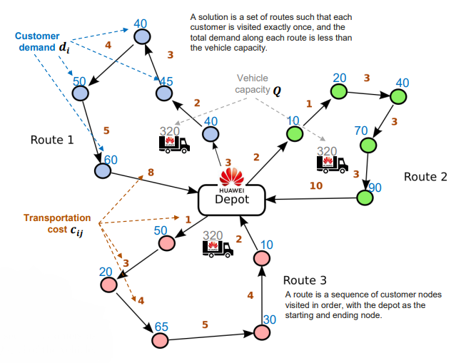
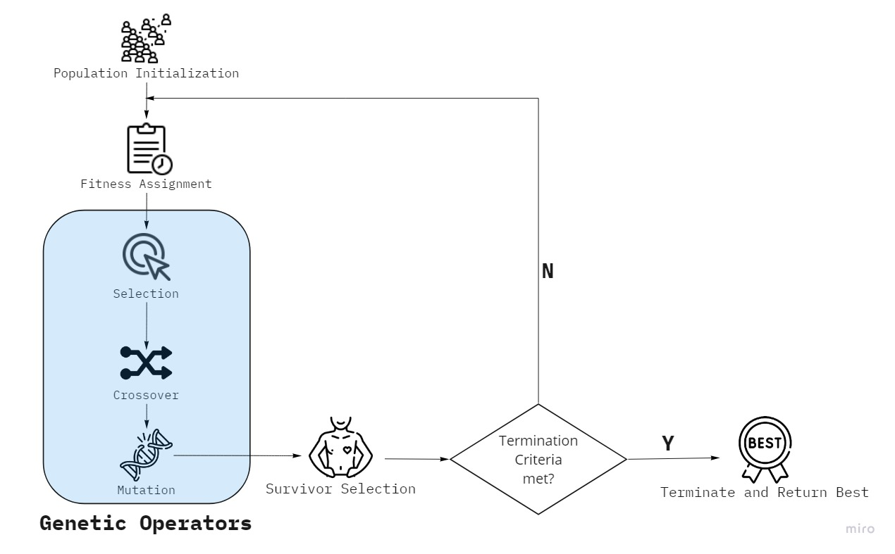
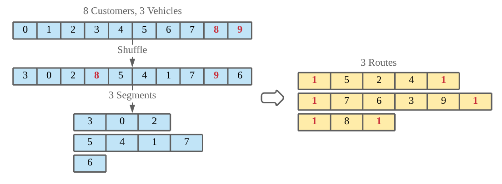
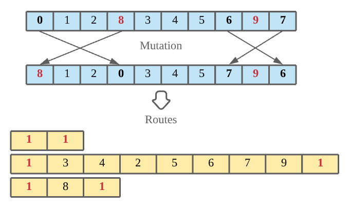
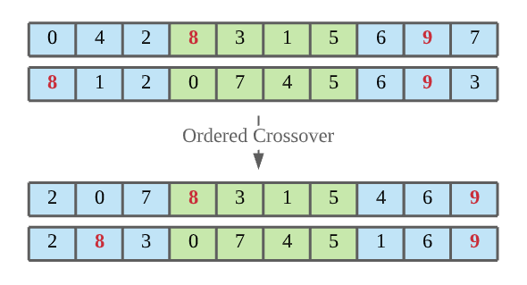

# 2021 Huawei Delivery Optimization Competition

## Introduction

The task of *2021 Huawei Delivery Optimization Competition* is to takes care of deliveries of consumables from a depot to customers.

- The depot has a given set of home vehicles, each with a certain capacity for carrying consumables.
- Customers are represented as nodes in a graph, in which edges have an associated transportation cost equal to the distance between the nodes.
- Each customer node has an associated demand for a consumable.

The target is to minimize the total transportation cost by determining a set of routes that meet the following requirements:

- Each vehicle has one route that starts and finishes at the depot.
- Each customer is visited exactly once.
- The total demand along each route is less than the vehicle capacity.

## Model Design

We used the genetic algorithm as our main process. It simulates the process of natural selection which means those species who can adapt to changes in their environment are able to survive, reproduce and go to next generation.

### Individual

For a task containing *N* customers and *M* vehicles, we used a permutation of *N + M - 1* consecutive numbers (0-based) to represent a transportation plan, consisting of both customers and depots. *M - 1* depots can split the customers into *M* segments. Each segment represents a route.

### Mutation

In a mutation operation, we randomly swapped the order of two nodes.

### Crossover

In a crossover operation, we executed ordered crossover on two parents to produce children.

### Selection

We use tournament selection, keeping transportation plans with the highest fitness from randomly chosen candidates.

The fitness is the cost of a transportation plan. For overloaded plans, a large value is added to fitness as a penalty. This value increases as overload weight increases.

## License

Distributed under the *MIT License*. See `LICENSE` for more information.